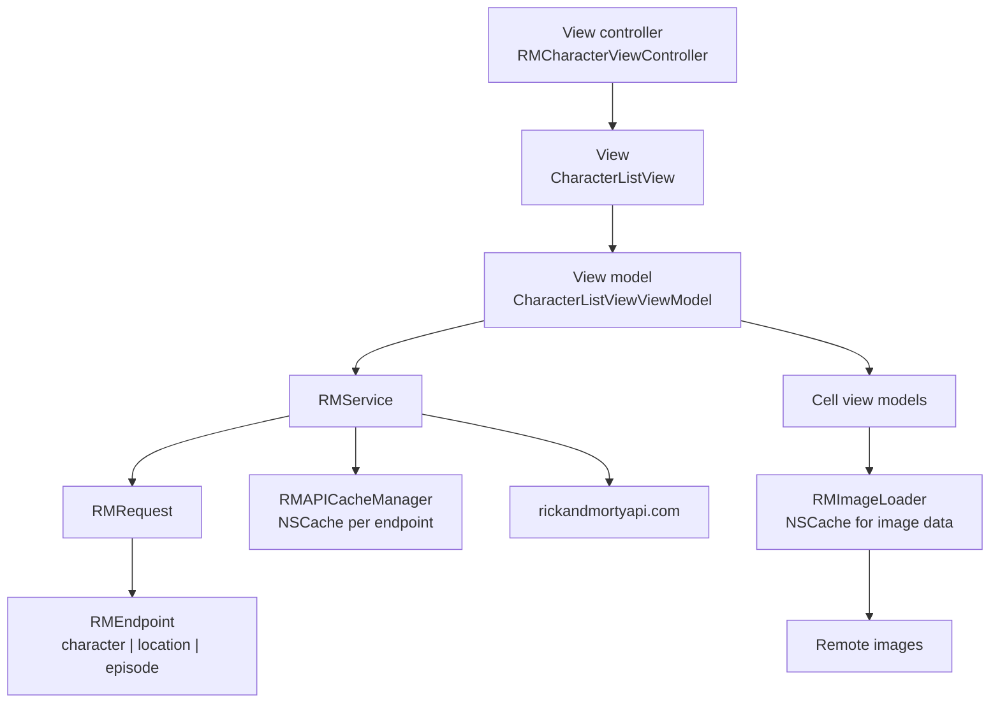
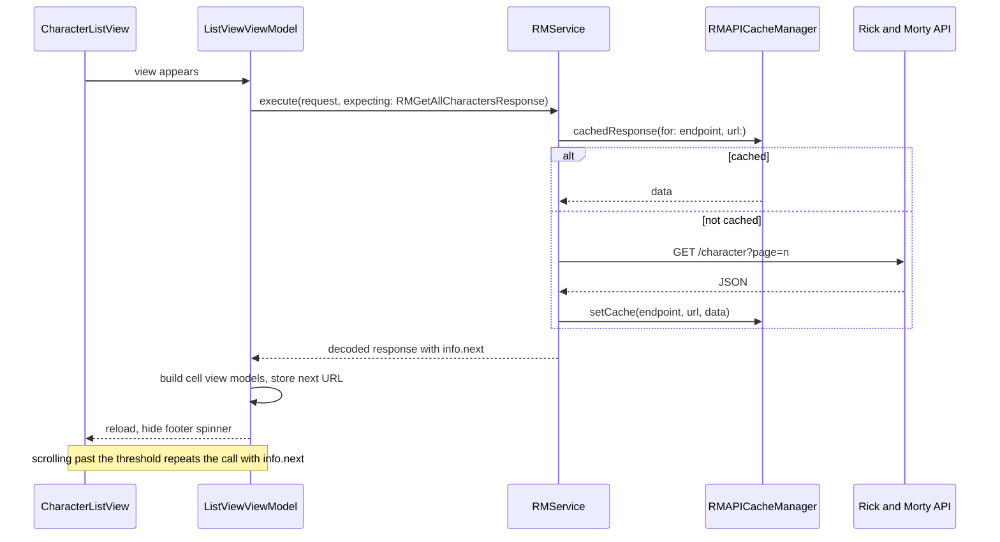

# Rick and Morty

*A full client for the Rick and Morty API, written in UIKit with no third party dependencies.*

    


## Overview

Four browsable sections (characters, locations, episodes, settings), each backed by a paginated
endpoint, plus a search screen with configurable filters. Everything from the request builder to the
image cache is written by hand, so the project shows how the pieces fit together rather than how a
library hides them.

The rule the project follows: a view controller owns a view, a view owns a view model, and only the
view model talks to the service layer. No controller ever constructs a URL.

## Architecture



`RMEndpoint` enumerates the API paths, `RMRequest` turns an endpoint plus query items into a URL, and
`RMService` performs the call and decodes into the expected `Codable` type. Because the service is
generic over the response type, adding a new endpoint costs one enum case and one model.

## Request and pagination flow



The response wrapper carries an `info` block with the next page URL. The view model keeps that URL,
appends new results to the existing array, and only shows the footer loader while a page is in
flight.

## Implementation notes

- **Caching in two layers.** `RMAPICacheManager` holds one `NSCache` per endpoint keyed by URL, so
  revisiting a tab does not refetch. `RMImageLoader` caches raw image data separately, which keeps
  scrolling smooth without a third party image library.
- **Compositional layout on detail screens.** The character detail view builds three section types
  (photo, information, episodes) with their own item and group sizing in one collection view.
- **View models per cell.** Formatting such as status text and image URL resolution lives in the cell
  view model, so cells stay free of business logic and can be reused in search results.
- **Search as a configured module.** `RMSearchViewViewModel` receives a configuration describing the
  type being searched and the available filters, so one search screen serves characters, locations
  and episodes.
- **SwiftUI where it helps.** The settings screen is a SwiftUI view hosted inside the UIKit tab bar,
  which keeps a simple static list simple.

## Project structure

```
RickandMorty/
├── APIClient/          RMEndpoint, RMRequest, RMService
├── Managers/           RMAPICacheManager, RMImageLoader
├── Models/             RMCharacter, RMEpisode, RMLocation, response wrappers
├── ViewModels/         list, detail, search and per cell view models
├── Views/              collection and table views, cells, search views, SwiftUI settings
└── Controllers/        Core tab controllers and Other detail controllers
```

## Requirements

Xcode 15 or later, iOS 17.2 or later. No package manager needed, the project has no external
dependencies.
